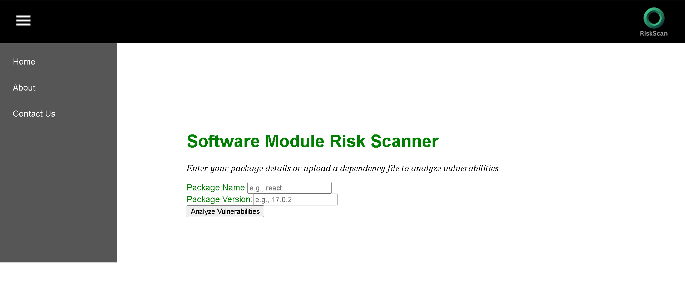
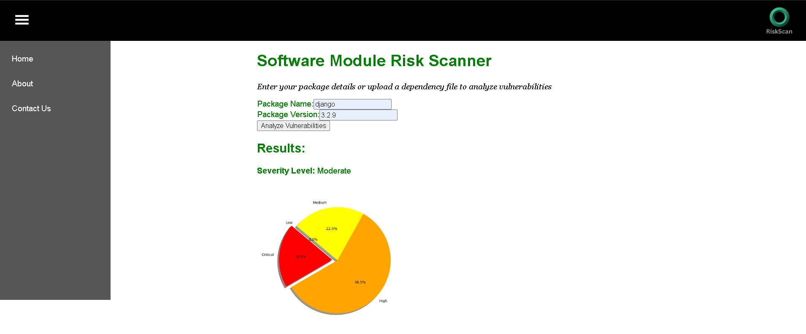

# Risk Scan Module

**Risk Scan Module** is a prototype tool designed to analyze the risks associated with open-source software modules. It leverages the **Open Source Vulnerability (OSV) API** in real time to detect vulnerabilities when a module becomes a dependency in developers’ applications.

## 🔎 Features
- **Real-time Risk Detection** – Fetches vulnerability data directly from the OSV API.  
- **Module & Version Based Analysis** – Enter the module name (e.g., `react`, `django`) with its version to assess risk.  
- **Severity Scoring** – Displays the overall severity level of the module.  
- **Graphical Visualization** – Uses **Matplotlib** to generate a clear severity-level graph.  
- **Threat Insights** – Shows detailed threats like **DDoS attacks, Man-in-the-Middle (MITM) attacks**, and more.  
- **Consolidated Vulnerability Report** – Combines all detected risks into a single overall vulnerability rating.  

## 📊 How It Works
1. User provides the **module name** and **version**.  
2. Tool queries the **OSV API** for vulnerability data.  
3. The system classifies severity levels (Critical, High, Medium, Low).  
4. Generates a **graph** showing the distribution of vulnerabilities.  
5. Displays a consolidated **module risk score**.  

## 🖼️ Application UI

  
(./images/ui3.png)   

## 🚀 Tech Stack
- **Frontend:** React.js  
- **Backend:** Flask, Node.js  
- **API:** OSV API  
- **Visualization:** Matplotlib  
- **Tools:** Postman (for testing APIs)  

## 📌 Real life use case
As developers increasingly rely on open-source dependencies, ensuring **security in the supply chain** is critical. Risk Scan Module helps identify potential risks early, improving overall software security.  

---
